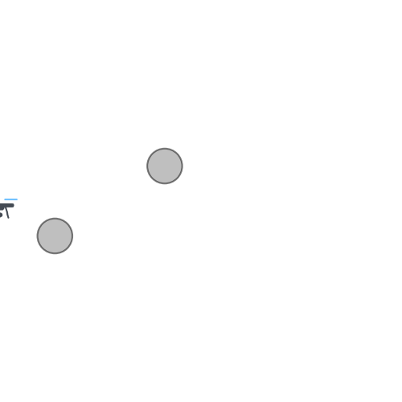

# PlotQuad

> **Note:** All code in this repository was written by Kleber Cabral. The README documentation and inline code comments were added with AI assistance (Claude).

Generates an animated GIF of a robot/quadrotor moving along a 2D trajectory, with a custom icon that follows the path and an optional trailing line.



## Structure

```
PlotQuad/
├── src/
│   └── generate_animation_from_trajectory.py   # animate_trajectory() + a runnable demo
├── assets/
│   └── quadIcon.png                            # default icon used by the demo
├── output/
│   └── quadTrajectory.gif                      # sample output (regenerated by the demo)
└── requirements.txt
```

## What it does

`src/generate_animation_from_trajectory.py` defines `animate_trajectory(horizontal, vertical, path_robot_icon, ...)`, which:
- Takes arrays of x/y positions,
- Draws the path icon (`assets/quadIcon.png` by default) moving frame-by-frame along that trajectory,
- Optionally overlays a fixed pair of circular "obstacle" markers,
- Saves the result as a GIF using matplotlib's `PillowWriter`.

The bottom of the script also runs a demo (a simple sine-wave path) when executed directly, writing to `output/quadTrajectory.gif`. Asset/output paths are resolved relative to the script's own location, so it runs correctly no matter what directory you invoke it from.

## Install

```bash
pip install -r requirements.txt
```

## Run

```bash
python src/generate_animation_from_trajectory.py
```

Edit the example call at the bottom of the script (or import `animate_trajectory` from it) to animate a different trajectory — swap in your own `horizontal`/`vertical` arrays and/or icon image.

## Key dependencies

- `matplotlib` (plotting + `PillowWriter` GIF export)
- `numpy`
- `pillow` (backs `PillowWriter`)

## Status

Small, working utility script — not a packaged library. Intended to be edited directly as new trajectory/animation needs come up rather than extended with a formal API. Verified working (regenerates `output/quadTrajectory.gif`) both when run from `src/` and from the project root.

## License

MIT — see [LICENSE](LICENSE).
